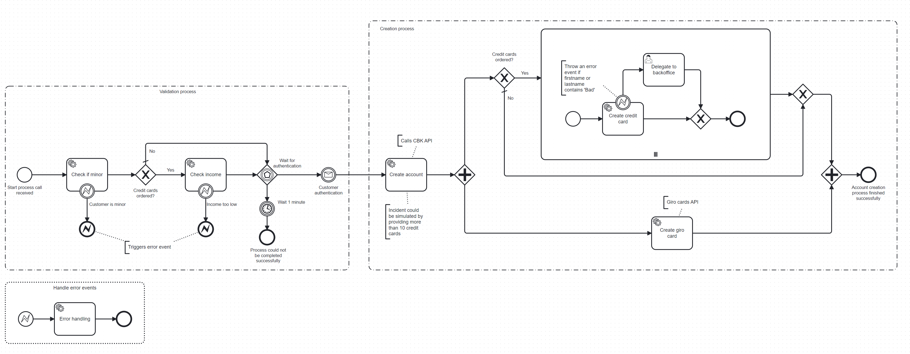

# Camunda 8 Demo Process

<details open>
<summary><b>Table of Contents</b></summary>

- [Introduction](#introduction)
- [Example Process](#example-process)
- [Getting started](#getting-started)
- [Roadmap](#roadmap)
- [Version history](#version-history)
- [Contact](#contact)
- [Links](#links)
</details>

## Introduction

Welcome to our Camunda 8 Demo Process! This project demonstrates the use of the process orchestration software Camunda 8 with the example of a simple bank account odering process.

#### Why are we using Camunda?

We do not wish to give a general overview about what Camunda offers as there are plenty of sources on the web that describe just that. Instead, we want to provide reasons why we use Camunda as compared to an approach without any BPMN engine.

The main reasons why we are using Camunda for business process modeling are:

- **Reduced development overhead** - Basic features and reusable workflow patterns are covered by Camunda while. Established patterns for rollbacks and errors improve the reliability of applications.
- **Freedom to concentrate on core software** - The orchestration engine covers crucial aspects while leaving room for developers to focus on implementing the custom logic desired by business.
- **Visibility and transparency** - The BPMN diagram acts as a common ground for discussions between developers and business side during development and beyond. Out-of-the-box tools support business intelligence (Camunda Optimize) and monitoring (Camunda Operate).


#### About this project

We demonstrate how Camunda 8 can be used to turn a BPMN model into a live end-to-end process that automates processes in a consistent, safe and transparent way. To get there, experts of different domains can collaborate on the basis of the BPMN model. Our project therefore allows you to slip into various roles:

- **As a customer** you can go through the frontend process. You can try out different combinations of products or input values and observe how the different outcomes are presented to you. (Not yet implemented)

- **As an operations engineer** you can step behind the scenes to monitor individual process instances, resolve issues and carry out manual tasks.

- **As a business analyst** your role is to analyze commonly occurring issues or bottlenecks and oversee the consistent execution of business rules. Based on your insights, maybe you can even draw conclusions how to optimize the process.

- **As a developer** you look further behind the scenes and into the code. Perhaps you may even play around and adapt the process: fixing issues, automating more tasks or adding new features.

The Camunda 8 platform offers these contributors to work together from development to production. The BPMN model serves as a basis and provides transparency about the process.

Feel free to explore the project from various angles!

## Example Process



#### Synchronous Part

During the first, synchronous part of the process, the customer is actively going through a frontend process. The Camunda 8 backend interferes to perform various validations.

1. **Process start**: The frontend triggers a new process instance to start after the customer has submitted an order.
2. **Age validation**: Validates the minimum age of the customer. If the customer is a minor, an error is triggered.
3. **Income check**: If the customer selected a credit card, it is checked that the income of the customer is above a certain minimum value. In case of a negative result, an error is triggered.
4. **Customer authentication**: The process waits for up to 1 min for the customer to authenticate themselves. If the customer takes longer, the process is aborted.


#### Asynchronous Part

When all validations are successfully passed, the process proceeds with the second, asynchronous part. It has the purpose of creating the requested products and therefore does not require any more input of the customer.

5. **Create account**: Creates the requested bank account in the internal bank systems. The following steps are executed in parallel.
6. **Create credit card**: Creates the requested credit card in the internal bank system. If multiple credit cards are requested, their creation is executed in parallel.
7. **Manual credit card creation**: If the automatic credit card creation fails, e.g. for technical reasons, the task is delegated to a manual worker.
8. **Create giro card**: Creates the requested giro card in the internal bank system.
9. **Process end**: After all previous parallel steps are finished, the process instance is terminated.

#### BPMN Elements

The example process showcases the use of different elements of a BPMN diagram:

- **Events:**
    - Start event
    - End event
    - Message catch events
    - Timer catch events
- **Task:**
    - Automated tasks, executing code
    - User tasks, executed by a human
- **Gateways:**
    - Parallel gateway - Subsequent tasks all subsequent paths in parallel
    - Exclusive gateway - Makes a decision based on data, taking only one of multiple outgoing paths
    - Event based gateway - Makes a decision based on an event
- **Text annotations**
    - Denoting called third party systems, e.g. APIs
    - Explanatory texts for events and tasks
- **Groups**
    - Graphic element to visually separate tasks
- **Multi instance activity:**
    - Enclosed elements are executed multiple times, e.g. in parallel
- **Errors**
    - Error boundary events
    - Error end events


## Getting started

Start the local environment with
```bash
cd camunda-docker
docker compose up -d
```
To start a process and send a message use the [rest-client](rest-client.http) file.  
To stop the local environment run:
```bash
docker compose down -v
```

You can log into the different services with the user demo and password demo:
- Operate: http://localhost:8081
- Tasklist: http://localhost:8082
- Optimize: http://localhost:8083
- Identity: http://localhost:8084
- Elasticsearch: http://localhost:9200

For Keycloak you can log in with the user admin and password admin: http://localhost:18080/auth/.

##  Roadmap

TBD

## Version History

* 0.2
    * Bug fixes and extensions

* 0.1
    * Initial release

## Contact

Disclaimer: Senacor Technologies is a partner of Camunda.

#### Authors

Developers
- Alexandra Štecová
- Bastian Laur
- Jan Stürzel
- Sergej Meister

Business analysts
- David Freund
- Philipp Klinger
- Julian Leischner
- Martin Fechter
- Markus Koch

## Links

* [Senacor Technologies](https://senacor.com/)
* [Camunda](https://camunda.com/)